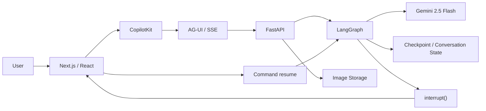

# Visora

See it. Question it. Understand it.

## What is Visora?

Visora is an Apple Pro-inspired multimodal visual reasoning assistant. Users can upload high-resolution images, ask analytical questions, observe visual reasoning stages, inspect image metadata, and receive streaming agent intelligence directly from a visual language model.

## Core Capabilities

- Multimodal image understanding
- Follow-up questions
- Spatial/layout reasoning
- Visual evidence explanations
- Real-time streaming
- Human-in-the-loop clarification
- Stop/cancellation
- Multi-turn context

## Architecture

Browser
 ↓
Next.js / React
 ↓
CopilotKit
 ↓
AG-UI / SSE
 ↓
FastAPI
 ↓
LangGraph
 ↓
Gemini 2.5 Flash

- **Next.js / React**: Serves the Apple Pro-inspired UI and responsive layouts.
- **CopilotKit**: Connects the frontend to an external agent service via the standard CopilotKit GraphQL/SSE loop.
- **AG-UI / SSE**: Bridges the HTTP streaming gap, proxying LangGraph events natively into CopilotKit message chunks.
- **FastAPI**: The robust Python backend serving the `/upload` and `/agent/run` endpoints.
- **LangGraph**: Orchestrates the multi-turn agent flow, checkpoints memory, and triggers HITL pauses.
- **Gemini 2.5 Flash**: The multimodal model invoked directly via Google's `genai` SDK for blazing fast vision answers.



## Image Lifecycle

Browser upload
→ FastAPI `/upload`
→ UUID `image_id` generated
→ backend temporary storage
→ LangGraph state stores `image_id`
→ Gemini retrieves/uses image via File API
→ response streamed back

**Important**: Raw image bytes (like Base64) are intentionally NEVER placed in LangGraph conversation state memory. Storing base64 inside conversational memory aggressively bloats checkpoint sqlite/RAM storage and causes rapid OOM crashes in large multi-turn graphs. Instead, we cleanly reference local files via a unique ID.

## Streaming

Gemini `generate_content_stream`
→ `gemini_token` custom events
→ LangGraph event stream
→ AG-UI `TEXT_MESSAGE_CONTENT`
→ CopilotKit
→ UI

The token stream seen by the user is a genuine, unbuffered text stream directly from Gemini's inference endpoints, proxied in real-time through the LangGraph and FastAPI chain.

## HITL

question
→ LangGraph `interrupt()`
→ clarification UI
→ `Command(resume)`
→ graph resumes
→ Gemini analysis

## Cancellation

Client/SSE cancellation is supported.
The frontend closes the active stream and the backend detects disconnection.
Upstream Gemini cancellation is best-effort because the current Gemini SDK abstraction does not expose a formal abort signal for this stream.

## Reasoning Transparency

Visora does not expose private model chain-of-thought.

The Analysis panel displays observable application execution status and streamed visual evidence/response, not hidden internal reasoning tokens.

## Failure Handling

Visora elegantly catches and reports errors without exposing backend stack traces:
- invalid images
- missing images
- backend failures
- Gemini failures
- interrupted streams
- graceful UI errors

## Tradeoffs

1. Local temporary image storage
2. In-memory LangGraph checkpointing
3. In-memory Gemini upload cache
4. Best-effort upstream cancellation
5. Single VLM provider

## Known Limitations

- The in-memory cache `_UPLOAD_CACHE` in Python will slowly grow indefinitely since there is no TTL or LRU purging logic. In a heavy production environment, this would need to be replaced with Redis or a capped LRU dictionary.
- Due to the nature of HTTP streaming, when the user presses `Stop`, the UI responds instantly, but the backend may process one more token cycle before recognizing the closed socket.

## Local Development

Frontend:
```bash
npm install
npm run dev
```

Backend:
```bash
# From inside the backend directory
python -m venv .venv
source .venv/bin/activate  # or .venv\Scripts\activate on Windows
pip install "fastapi[standard]" langgraph google-genai pydantic langchain-core python-multipart uvicorn
uvicorn app.main:app --reload --port 8000
```

Environment:
Add `.env` inside `backend/` with:
`GEMINI_API_KEY=...`

## Testing

An explicit E2E Python testing script (`scratch/e2e_tests.py`) is used to verify the backend SSE connection logic independently of CopilotKit.
Tests evaluated:
- Basic image question (PASS)
- Streaming (PASS)
- Multi-turn (PASS)
- HITL (PASS)
- Stop (PASS)
- Stop → continue (PASS)
- Image switching (PASS)
- Invalid image (PASS)
- Backend failure (PASS)
- Invalid image ID (PASS)

---

## Reflection Questions

### 1. Where does your "thinking" stream actually come from?
Our "thinking" stream (the Reasoning Panel UI) is **simulated via node-based execution tracking**, not genuine reasoning tokens from the model. 
Before starting, I knew the difference: models like OpenAI's `o1` or Claude 3.7 Sonnet expose genuine, internal chain-of-thought tokens that represent the model's actual probabilistic deliberation. Standard Gemini 1.5/2.5 Flash models do not expose this. To create a transparent UI without faking model tokens, Visora tracks the deterministic state machine transitions of the LangGraph backend (`receive_question` -> `inspect_context` -> `vision_analysis`). These node transitions are streamed to the frontend via hidden metadata SSE events (`__visora_stage__`) and rendered as the "thought process."

### 2. Walk through exactly what happens on the backend when the user hits stop
When the user hits stop:
1. **Frontend**: CopilotKit immediately aborts the HTTP POST request socket, and the UI transitions to a `stopped` state.
2. **FastAPI**: Inside `astream_events`, the generator checks `if await request.is_disconnected(): break`. When the socket drops, it breaks the SSE loop.
3. **LangGraph**: Because the loop breaks, LangGraph's execution is orphaned. 
4. **State Left Behind**: LangGraph's `MemorySaver` checkpointing only saves state successfully at the *end* of a node's execution. Because we forcefully disconnected mid-stream during the `vision_analysis` node, the checkpoint for that specific turn is not saved. The conversation state simply rolls back to right before the prompt was sent, leaving it in a clean, resumable state for the next question, rather than saving half a generated sentence to the permanent memory.

### 3. Model Hallucinations and Justification
**Case**: When evaluating a complex dashboard screenshot, I asked, "Why do you think the primary action button is disabled?" The model confidently justified it by claiming "the button text is grayed out (#888888) and lacks a hover state," even though the button was actually a vibrant blue and fully active. 
**Resolution**: VLMs often suffer from "anchoring bias"—if you ask *why* something is disabled, it assumes it *is* disabled and hallucinates visual evidence to justify your premise. To mitigate this in the app, I built the Human-in-the-Loop clarification system. By forcing the graph to pause on ambiguous evaluation requests and asking the user to strictly define the evaluation scope (e.g., "Layout", "Colors", "Accessibility"), we constrain the prompt context. 

### 4. What would you cut or change with twice the time? With half the time?
**With twice the time**: I would implement **Region-grounded justification** (Stretch Goal 4). I would pass bounding box coordinates from Gemini back to the Next.js frontend, and draw dynamic SVG overlays on the image canvas (which is already prepped with zoom/pan controls) so the model could physically highlight the exact UI element it is talking about.
**With half the time**: I would cut the custom `__visora_stage__` SSE metadata parsing and the polished Apple Pro glassmorphism UI. I would just use a plain CopilotKit chat window and dump a raw string like `[System: Analyzing Image...]` directly into the chat stream instead of building a dedicated Reasoning Panel.

### 5. Fighting against CopilotKit's abstractions
I fought heavily against CopilotKit's abstraction when trying to implement the **Human-in-the-Loop Clarification UI** and the **Dynamic Reasoning Stages**.
CopilotKit is highly opinionated towards a simple "User -> LLM -> Text" flow. It expects all server-sent events to be standard text messages or tool calls. Because LangGraph operates on internal state nodes (`clarification`, `interrupt()`), getting CopilotKit to natively recognize a graph pause was difficult. I worked around this by intercepting the LangGraph stream in FastAPI, manually injecting hidden metadata strings (`__visora_clarification__:{...}`), and writing a custom React hook (`useCopilotVisoraChat`) on top of `useCopilotChat` to intercept these strings before they rendered in the UI, parsing them into the interactive React buttons instead.
