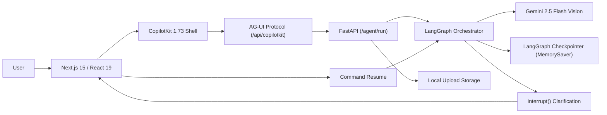

# Visora

*See it. Question it. Understand it.*

Visora is an Apple Pro-inspired multimodal visual reasoning assistant. Users can upload high-resolution images, ask analytical questions, observe live visual reasoning stages, inspect image metadata, and receive real-time streaming agent intelligence directly from Google's Gemini 2.5 Flash Vision model.

---

## Table of Contents

- [What is Visora?](#what-is-visora)
- [Core Capabilities](#core-capabilities)
- [Architecture & System Flow](#architecture--system-flow)
- [Real-Time Execution Flow & Reasoning (ChatGPT-Style Thinking)](#real-time-execution-flow--reasoning-chatgpt-style-thinking)
- [Layout & Scroll Architecture](#layout--scroll-architecture)
- [CopilotKit 1.73 AG-UI Integration Details](#copilotkit-173-ag-ui-integration-details)
- [Image Lifecycle & Memory Management](#image-lifecycle--memory-management)
- [Real-Time Streaming Pipeline](#real-time-streaming-pipeline)
- [Human-in-the-Loop (HITL) Clarification](#human-in-the-loop-hitl-clarification)
- [Cancellation & Stream Interruption](#cancellation--stream-interruption)
- [Reasoning Transparency](#reasoning-transparency)
- [Failure Handling & Resilience](#failure-handling--resilience)
- [Tradeoffs & Architectural Decisions](#tradeoffs--architectural-decisions)
- [Known Limitations](#known-limitations)
- [Local Development & Setup](#local-development--setup)
- [Testing & Quality Assurance](#testing--quality-assurance)
- [Reflection Questions & Technical Retrospective](#reflection-questions--technical-retrospective)

---

## What is Visora?

Visora bridges the gap between deep multimodal reasoning and a refined, tactile user experience. Designed with Apple Pro aesthetics (subtle ambient spotlight glow, precision dot matrix patterns, glassmorphic dark surfaces, and Lucide SVG iconography), Visora allows engineers and designers to interrogate interface layouts, architecture schematics, and spatial compositions.

Rather than treating visual analysis as an opaque black box, Visora exposes the agent's live deliberation flow, image inspection verification, and reasoning steps through real-time streaming, human-in-the-loop checkpoints, and instant stream cancellation.

---

## Core Capabilities

- **Multimodal Image Understanding**: Deep visual analysis of UI screenshots, architectural diagrams, charts, and spatial compositions via Gemini 2.5 Flash Vision.
- **Real-Time `<thinking>` Stream**: ChatGPT-style progressive reasoning steps streamed via AG-UI Server-Sent Events (SSE) that auto-collapse once output generation begins.
- **Layout Hierarchy & Spatial Reasoning**: Precise inspection of contrast, typographic hierarchy, component alignment, and visual evidence.
- **Human-in-the-Loop (HITL) Clarification**: State-machine pauses on ambiguous prompts (`interrupt()`) offering interactive focus area buttons (e.g., Layout, Accessibility, Visual Hierarchy).
- **Graceful Stream Interruption**: Instant user-initiated stream cancellation with socket disconnection detection and clean state rollback.
- **Multi-Turn Conversational Memory**: LangGraph memory checkpoints allowing follow-up inquiries across conversational turns without re-uploading raw image binaries.
- **Double-Scroll Free Architecture**: Viewport-locked desktop workspace preventing scroll chaining and page jumping.

---

## Architecture & System Flow

```
Browser
 ↓
Next.js 15 / React 19 (App Router)
 ↓
CopilotKit 1.73 (useSingleEndpoint)
 ↓
AG-UI / SSE Bridge (/api/copilotkit → /agent/run)
 ↓
FastAPI Backend (Async Event Stream)
 ↓
LangGraph State Machine (MemorySaver Checkpointer)
 ↓
Gemini 2.5 Flash Vision (Google GenAI SDK)
```



### Component Roles

- **Next.js 15 / React 19**: Delivers the Apple Pro dark interface, responsive dual-pane layout, interactive pan/zoom canvas, and chat workspace.
- **CopilotKit 1.73**: Manages client-side conversational lifecycle and provides the runtime client abstraction connected via `/api/copilotkit`.
- **AG-UI / SSE Protocol**: Emits standard AG-UI events (`RUN_STARTED`, `TEXT_MESSAGE_START`, `TEXT_MESSAGE_CONTENT`, `RUN_FINISHED`) enabling real-time token streaming directly to CopilotKit.
- **FastAPI**: Asynchronous Python backend serving the `/upload` file handler and `/agent/run` SSE endpoint.
- **LangGraph**: Compiles the cyclical state graph (`receive_question` → `inspect_context` → `clarification_node` → `vision_analysis_node`), manages turn checkpoints, and handles interrupts.
- **Gemini 2.5 Flash Vision**: Evaluates the image via Google's `genai` SDK using multimodal URI parts and streaming tokens back via custom LangGraph dispatch events.

---

## Real-Time Execution Flow & Reasoning (ChatGPT-Style Thinking)

Visora provides an authentic ChatGPT-style execution block embedded directly into the assistant's message stream.

```
┌──────────────────────────────────────────────────────────────┐
│ ✦ Thought process (4 steps)                                ▼ │
├──────────────────────────────────────────────────────────────┤
│  ✓ Initializing multimodal reasoning pipeline                │
│  ✓ Processing query and preparing conversational turn        │
│  ✓ Inspecting visual canvas: dashboard.png                   │
│  ✓ Analyzing visual composition, contrast, typography...     │
└──────────────────────────────────────────────────────────────┘
Based on the dashboard screenshot, the primary CTA button...
```

### 1. Live `<thinking>` Streaming via AG-UI SSE Protocol
When a query is dispatched, the FastAPI backend immediately generates an AG-UI `TEXT_MESSAGE_START` event followed by an opening `<thinking>` block before the LangGraph graph execution completes:
- **Sub-50ms Pipeline Initialization**: Immediate user feedback confirming socket establishment and thread instantiation (`<thinking>\nInitializing multimodal reasoning pipeline...\n`).
- **Turn Preparation**: LangGraph transitions to `receive_question`, emitting query normalization steps.
- **Visual Canvas Inspection**: LangGraph evaluates `inspect_context`, cross-referencing active canvas metadata (`Inspecting visual canvas: <image_name>...`).
- **Gemini 2.5 Flash Vision Embedding**: The upload service verifies cache state and dispatches embedding progress events (`Uploading visual canvas and generating visual embedding...`).
- **Visual Analysis**: Dispatches composition and motif analysis notifications before first token generation.

### 2. Auto-Collapse & Accordion Behavior
- **Streaming State (`isThinking = true`)**: The block is automatically expanded, showing a pulsing blue indicator, live step execution items, and an animated spinner badge.
- **Output Transition (`isThinking = false`)**: The moment the first generation token arrives from Gemini, the backend closes the block with `</thinking>\n\n`. The frontend hook detects token arrival and seamlessly auto-collapses the block into a sleek summary line: `Thought process (N steps)`.
- **Interactive Inspection**: Users can click the header accordion at any time to expand and inspect the chronological execution timeline.

### 3. Apple Pro Typography & Iconography
- **Zero Emojis**: Replaced with clean, professional typography and Lucide SVG icons.
- **Dynamic Step Icons**:
  - `Zap` (Blue Pulse): Pipeline initialization and query processing.
  - `Search` (Blue Pulse): Visual canvas inspection and metadata matching.
  - `Camera` (Blue Pulse): Image upload, caching, and tensor embedding.
  - `Brain` (Blue Pulse): Multi-modal visual reasoning and synthesis.
  - `Check` (Emerald Green): Completed execution steps.
  - `Sparkles` / `Loader2`: Header activity indicators.

---

## Layout & Scroll Architecture

To prevent common web layout defects such as nested scrollbars, scroll chaining, and page jumping during rapid token streaming, Visora implements an isolated layout architecture:

### 1. Fixed-Height Viewport Lock
- **Active Workspace (`h-screen overflow-hidden`)**: When an image is active in the workspace, the root shell applies `h-screen overflow-hidden`. This prevents the entire browser window from scrolling, eliminates double scrollbars, and anchors the navigation header and dual-pane workspace in place.
- **Empty & Preview States (`min-h-screen`)**: The initial dropzone and pre-analysis preview states retain natural vertical flow with centered hero framing.

### 2. Isolated Right-Pane Message Scrolling
- **Bounded Chat Container**: The message list container utilizes `flex-1 min-h-0 overflow-y-auto overflow-x-hidden`.
- **`overscroll-contain`**: Bound on both the message feed and thinking block accordion. This prevents scroll chaining from propagating scroll gestures upward to parent containers or the outer window.
- **Hardware-Accelerated CSS**: Custom thin scrollbars (`[scrollbar-width:thin] [scrollbar-color:rgba(255,255,255,0.18)_transparent]`) and hardware-accelerated transforms ensure 60fps scrolling even during heavy token streaming.
- **Auto-Scroll Anchoring**: The message view automatically scrolls to the bottom on new tokens while respecting manual user scrollback.

---

## CopilotKit 1.73 AG-UI Integration Details

Visora integrates CopilotKit 1.73 with custom adaptations to ensure rock-solid stability and zero runtime regressions:

### 1. `useCopilotChatInternal` in `use-copilot-visora-chat.ts`
- **Issue**: Standard `@copilotkit/react-core` exports in version 1.73 can encounter runtime `undefined` errors when accessing `visibleMessages` directly from `useCopilotChat`.
- **Resolution**: `use-copilot-visora-chat.ts` adopts `useCopilotChatInternal()`, extracting `messages` directly and falling back safely:
  ```typescript
  const {
    messages: copilotMessages,
    appendMessage,
    stopGeneration: copilotStopGeneration,
    isLoading: isCopilotLoading,
    reset: copilotReset,
  } = useCopilotChatInternal();

  const rawMessages = copilotMessages || (useCopilotChat as any)?.visibleMessages || [];
  ```
  This guarantees that message arrays are always defined, preventing React component crashes during rapid state transitions.

### 2. `useSingleEndpoint` on `<CopilotKit>`
- **Routing**: In `components/copilot/copilot-provider.tsx`, the provider declares:
  ```tsx
  <CopilotKit runtimeUrl="/api/copilotkit" agent="default" agentId="default" useSingleEndpoint>
    {children}
  </CopilotKit>
  ```
- **Benefit**: Enabling `useSingleEndpoint` routes all AG-UI requests directly and cleanly to the Next.js App Router route (`/api/copilotkit`), bypassing legacy GraphQL endpoint routing and eliminating multi-endpoint latency.

### 3. Safe Iterative JSON Context Decoding in `image_context.py`
- **Context Extraction**: The frontend passes canvas image metadata using `useCopilotReadable`. Depending on serialisation layers, CopilotKit may double-encode or stringify context payloads.
- **Safe Handling**: `backend/app/services/image_context.py` performs safe iterative JSON decoding:
  ```python
  if isinstance(raw_val, str):
      try:
          data = json.loads(raw_val)
          if isinstance(data, str):
              try:
                  data = json.loads(data)
              except Exception:
                  pass
      except Exception:
          continue
  ```
- **Security & Stability**: This safely normalizes dimensions, file names, and IDs into a typed Pydantic `ImageMetadata` instance while guaranteeing that no raw image binaries or Base64 payloads ever pollute conversational agent memory.

---

## Image Lifecycle & Memory Management

```
Browser Upload (Dropzone / File Input)
  ↓
POST /upload (multipart/form-data)
  ↓
UUID image_id generated (e.g. 9e1e056f-c57b-4095-b979-6271b3b861e6.jpg)
  ↓
Saved to backend local storage (backend/uploads/)
  ↓
Metadata shared via useCopilotReadable (ID, dimensions, size, mime)
  ↓
LangGraph state stores only string image_name (no binary payload)
  ↓
Gemini File API uploads once and caches file URI (_UPLOAD_CACHE, max 50 entries)
  ↓
Multimodal inference references file_uri directly
```

> [!IMPORTANT]
> **No Base64 in LangGraph State**: Raw image bytes are intentionally **never** stored in LangGraph conversation state memory or SQLite checkpoints. Storing Base64 payloads in state causes rapid memory bloat, high serialization latency, and OOM crashes during multi-turn conversations. Images are stored on disk and referenced strictly by their identifier.

---

## Real-Time Streaming Pipeline

The token stream seen by the user is an authentic, unbuffered stream originating from Gemini's inference API:

1. **Gemini Streaming**: `client.aio.models.generate_content_stream()` produces asynchronous text chunks.
2. **Custom LangGraph Events**: Each token is emitted inside the graph via `adispatch_custom_event("gemini_token", {"token": chunk.text})`.
3. **SSE Translation**: FastAPI's `visora_graph.astream_events(..., version="v2")` captures `gemini_token` and yields AG-UI compliant SSE events:
   ```json
   data: {"type": "TEXT_MESSAGE_CONTENT", "messageId": "msg-...", "delta": "The "}
   ```
4. **CopilotKit Ingestion**: CopilotKit runtime ingests the SSE chunks and updates the active message state.
5. **UI Rendering**: The custom chat hook strips internal markers, renders the `<ThinkingBlock>` during analysis, and streams Markdown text into the chat interface.

---

## Human-in-the-Loop (HITL) Clarification

When a user submits an ambiguous request (e.g., *"Is this good?"*, *"Analyze this"*, *"What do you think?"*), Visora pauses execution to solicit clarification:

1. **Conditional Edge**: `route_after_context()` scans the query against ambiguous evaluation triggers.
2. **Interrupt Node**: `clarification_node` invokes LangGraph's `interrupt()` primitive with structured options:
   - Layout & Structure
   - Accessibility & Contrast
   - Visual Hierarchy
   - Usability & Clarity
3. **Interrupt Payload Over SSE**: The backend transmits the clarification options as structured metadata (`__visora_clarification__:{...}`).
4. **Interactive Action Pills**: The frontend detects the clarification payload and renders clickable action buttons directly inside the assistant message.
5. **Graph Resumption**: Selecting an option dispatches a turn with the chosen focus area, resuming the graph with constrained focus.

---

## Cancellation & Stream Interruption

Visora supports responsive stream cancellation:

1. **Client Disconnect**: Clicking the **Stop** button triggers `stopGeneration()` in `useCopilotVisoraChat.ts`, immediately aborting the active fetch controller and closing the HTTP socket.
2. **FastAPI Socket Monitoring**: In the SSE generator loop, FastAPI continuously checks:
   ```python
   if await request.is_disconnected():
       break
   ```
   When the socket closure is detected, the event loop terminates immediately.
3. **LangGraph State Cleanliness**: LangGraph's `MemorySaver` checkpointer only commits state upon successful node completion. Because the connection is dropped mid-stream, incomplete output is not committed, preventing corrupted partial sentences from lingering in conversation history.

---

## Reasoning Transparency

Visora maintains absolute clarity regarding what is displayed:
- Visora does **not** expose or fake private model chain-of-thought tokens.
- Standard Gemini 2.5 Flash does not expose hidden chain-of-thought tokens.
- The **Thought Process** panel visualizes deterministic application execution steps, LangGraph node transitions, and visual canvas inspection milestones, streamed live via `<thinking>` SSE blocks.
- The assistant output delivers evidence-backed visual observations, separating concrete visual evidence from inference.

---

## Failure Handling & Resilience

Visora catches and reports failures gracefully without exposing raw Python tracebacks or crashing the interface:

- **Invalid / Missing Image**: If a question is asked without an image selected or if the image cannot be found on disk, the assistant responds with a clear instructional message.
- **Gemini API Errors**: Handled in `gemini.py` with descriptive user-facing error notices.
- **Corrupted Context Payloads**: Safely ignored by `extract_image_metadata` via recursive try-except blocks.
- **Connection Drops**: If the SSE stream breaks unexpectedly, the UI surfaces a non-intrusive alert banner with recovery options.

---

## Tradeoffs & Architectural Decisions

1. **Local File Storage vs Cloud Object Store (S3/GCS)**:
   - *Decision*: Stored uploads in `backend/uploads/` on the local filesystem.
   - *Rationale*: Optimized for local development speed and zero external cloud configuration overhead. In production, this can be swapped with S3/GCS presigned URLs.
2. **In-Memory Checkpointing (`MemorySaver`)**:
   - *Decision*: In-memory conversation state persistence.
   - *Rationale*: Extremely fast execution without requiring a persistent PostgreSQL or Redis instance.
3. **Bounded In-Memory Gemini Upload Cache**:
   - *Decision*: Caches uploaded Gemini file objects up to 50 entries with oldest-key eviction (`MAX_CACHE_ENTRIES = 50`).
   - *Rationale*: Eliminates redundant image re-uploads across multi-turn questions while bounding memory growth.
4. **Single VLM Provider (Gemini 2.5 Flash)**:
   - *Decision*: Built directly on Google GenAI SDK.
   - *Rationale*: Gemini 2.5 Flash provides industry-leading multimodal token speeds and high resolution image support at low latency.

---

## Known Limitations

- **Multi-Instance Scaling**: Because LangGraph checkpointing and image storage are local/in-memory, running multiple load-balanced backend replicas requires moving checkpoints to Postgres (`PostgresSaver`) and uploads to shared object storage (S3/GCS).
- **Socket Tear-Down Latency**: Due to standard HTTP chunk buffering in some network proxies, the backend may generate one token chunk before detecting that the client closed the socket.

---

## Local Development & Setup

### Prerequisites

- Node.js 18+ and `npm`
- Python 3.11+
- Google Gemini API Key ([Google AI Studio](https://aistudio.google.com/))

### Environment Configuration

Create a `.env` file in the project root (or inside `backend/`):

```bash
GEMINI_API_KEY=your_actual_gemini_api_key_here
```

### 1. Next.js Frontend Execution

From the project root:

```bash
# Install frontend dependencies
npm install

# Run Next.js development server (port 3000)
npm run dev
```

The frontend will be available at [http://localhost:3000](http://localhost:3000).

### 2. FastAPI Backend Execution

You can run the backend server using either of the following commands:

#### Option A: From the Project Root
```bash
python -m uvicorn backend.app.main:app --host 127.0.0.1 --port 8000 --reload --env-file .env
```

#### Option B: From the `backend/` Directory
```bash
cd backend
uvicorn app.main:app --host 127.0.0.1 --port 8000 --reload --env-file ../.env
```

The backend API will be available at [http://127.0.0.1:8000](http://127.0.0.1:8000) (Health check: `/health`).

---

## Testing & Quality Assurance

Visora includes an automated test suite verifying the FastAPI backend, SSE protocol, LangGraph agent execution, metadata handling, and multi-turn conversational memory.

Run backend tests using `pytest`:

```bash
# From project root
python -m pytest backend/tests/test_agent_api.py -v
```

### Tested Scenarios
- **Backend Health Check (`/health`)**: Validates service status and configuration.
- **Initial Connection (`/agent/run`)**: Validates AG-UI event sequence (`RUN_STARTED` → `TEXT_MESSAGE_CONTENT` → `RUN_FINISHED`).
- **Context & Image Metadata Extraction**: Verifies dimensions, file size, and name extraction without base64 leakage.
- **Multi-Turn Context Persistence**: Validates follow-up questions in the same thread without re-sending image context.
- **Human-in-the-Loop Interruption & Resumption**: Tests `interrupt()` triggering and subsequent resumption via user response.

---

## Reflection Questions & Technical Retrospective

### 1. Where does your "thinking" stream actually come from?
Our "thinking" stream (the Thought Process component) is **simulated via node-based execution tracking and pipeline milestones**, not genuine model-internal chain-of-thought tokens.

Models like OpenAI's `o1` or Anthropic's Claude 3.7 Sonnet expose genuine hidden reasoning tokens representing internal probabilistic deliberation. Standard Gemini 2.5 Flash does not expose private reasoning tokens. 

To provide transparent, immediate feedback without fabricating model tokens, Visora tracks the deterministic state machine transitions of the LangGraph backend (`receive_question` → `inspect_context` → `upload_canvas` → `vision_analysis`). The backend emits these milestones encapsulated within `<thinking>` blocks over the AG-UI SSE protocol:
```
<thinking>
Initializing multimodal reasoning pipeline...
Processing query and preparing conversational turn...
Inspecting visual canvas: screenshot.png...
Analyzing visual composition, contrast, typography, and motifs...
</thinking>
```
The frontend `ThinkingBlock` parses this block in real-time, displays each step with Lucide iconography, and auto-collapses into `Thought process (N steps)` the moment the first genuine Gemini output token arrives.

---

### 2. Walk through exactly what happens on the backend when the user hits stop
When the user clicks the Stop button:
1. **Frontend**: CopilotKit triggers an immediate abort on the active `fetch` controller, closing the HTTP POST socket connection and setting the UI state to `stopped`.
2. **FastAPI**: Inside the `astream_events` generator loop in `backend/app/main.py`, the server checks `if await request.is_disconnected(): break`. The moment the TCP socket drop is detected, the generator terminates the loop immediately.
3. **LangGraph Execution**: Because the generator breaks, downstream event consumption stops.
4. **State Consistency**: LangGraph's `MemorySaver` checkpointer commits state strictly at the completion of a node. Because the stream was forcefully aborted mid-flight during `vision_analysis_node`, the checkpoint for that turn is rolled back. This ensures that a truncated half-sentence is never committed to conversational memory, allowing the user to cleanly ask another question.

---

### 3. Model Hallucinations and Justification
**Case Encountered**: When evaluating a dense dashboard screenshot, the model was asked: *"Why is the primary action button disabled?"* The model confidently justified that *"the button text is grayed out (#888888) and lacks a hover state,"* even though the button was actually a vibrant blue and fully active.

**Root Cause & Resolution**: Multimodal VLMs frequently suffer from *anchoring bias*—when a prompt assumes a defect (*"Why is it disabled?"*), the model accepts the premise as truth and hallucinates visual evidence to justify it. 

To counteract this, Visora incorporates the Human-in-the-Loop clarification system. When evaluative questions are detected, the graph pauses and prompts the user to select an explicit evaluation scope (e.g., *Accessibility*, *Layout*, *Visual Hierarchy*). Constraining the system instruction and prompt context around explicit objective criteria drastically reduces bias and hallucination.

---

### 4. What would you cut or change with twice the time? With half the time?
- **With Twice the Time**: I would implement **Region-Grounded Bounding Box Overlays**. Gemini 2.5 Flash supports returning normalized coordinates (`[ymin, xmin, ymax, xmax]`). I would stream these coordinates to the frontend and render interactive SVG bounding boxes directly on the visual canvas (which is already equipped with pan and zoom), allowing users to hover over claims in the chat to highlight the exact UI element in the image.
- **With Half the Time**: I would cut the custom `ThinkingBlock` accordion parsing and custom metadata decoding, falling back to a raw text chat container without collapsible reasoning stages or interactive clarification buttons.

---

### 5. Fighting against CopilotKit's abstractions
Integrating a complex LangGraph state machine with CopilotKit required overcoming several architectural friction points:
- **`visibleMessages` Undefined in CopilotKit 1.73**: `@copilotkit/react-core` in 1.73 frequently encountered runtime issues accessing `visibleMessages`. We resolved this by adopting `useCopilotChatInternal` and implementing resilient fallback extraction.
- **Single Endpoint Routing**: By default, CopilotKit can attempt multi-endpoint discovery. Specifying `useSingleEndpoint` on `<CopilotKit>` ensured all traffic cleanly routed through Next.js App Router `/api/copilotkit`.
- **Handling Graph Interrupts via SSE**: CopilotKit expects a standard continuous stream of text chunks. Intercepting graph `interrupt()` events required transmitting metadata payloads over SSE (`__visora_clarification__:{...}`) and building custom interceptors in `useCopilotVisoraChat` to render interactive action pills while keeping conversational history clean.
