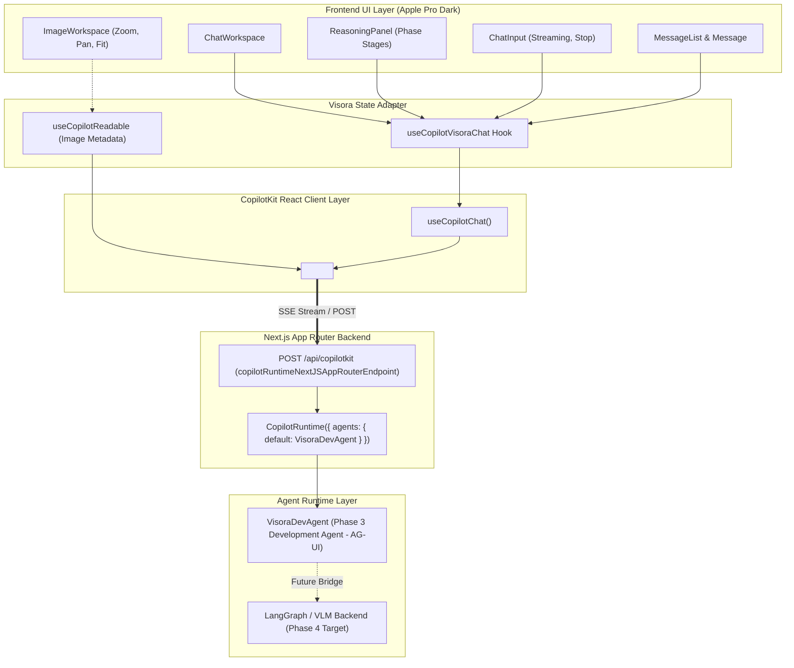

# Visora — Multimodal Visual Reasoning Assistant

> **See it. Question it. Understand it.**

Visora is an Apple Pro-inspired multimodal visual reasoning assistant. Users can upload high-resolution images, ask analytical questions, observe visual reasoning stages, inspect image metadata, and receive streaming agent intelligence.

---

## Current Status: Phase 3 (CopilotKit Integration)

Phase 3 introduces **real CopilotKit runtime infrastructure** to Visora, establishing the official agent-to-UI communication boundary while cleanly preserving the decoupled frontend architecture.

### Architectural Boundary & Responsibilities



---

## State Ownership & Integration Architecture

### 1. Why CopilotKit Was Introduced
Rather than building ad-hoc WebSocket connections, proprietary streaming protocols, or premature hardcoded LLM endpoints, CopilotKit provides:
- Standardized Agent-User Interaction protocol (AG-UI)
- Out-of-the-box streaming lifecycle management (`RUN_STARTED`, `TEXT_MESSAGE_CONTENT`, `RUN_FINISHED`)
- First-class context injection via `useCopilotReadable`
- A clean, standardized abstraction for swapping in a LangGraph state graph in Phase 4 without touching the frontend components

### 2. What CopilotKit Owns Now
- **Agent Execution Pipeline**: Handles user turn submission and dispatches to `/api/copilotkit`.
- **Runtime Message Flow**: Assistant responses are streamed from the server runtime through standard Server-Sent Events (SSE).
- **Readable Context Protocol**: Supplies clean, structured image metadata (`imageId`, `imageName`, `imageType`, `dimensions`, `fileSize`) to the agent context without clogging chat state with raw image binaries.
- **Message Normalization**: Translates runtime messages into the UI message pipeline through the `useCopilotVisoraChat` adapter.

### 3. What Remains Local UI State
- **Image Canvas Controls**: Zoom factor, pan coordinates, fit-to-screen toggle, actual-size display, image upload/replacement.
- **Visual Reasoning Stage Animation**: The collapsible reasoning panel stages ("Visual decomposition", "Salience mapping", "Feature correlation", "Synthesizing response") remain client-driven UI visual indicators for responsiveness.
- **Local Stream Interruption**: Client-side cancellation when the user clicks "Stop".
- **Local Toast & Notifications**: Error handling and connection status indicators.

### 4. What Is Still Placeholder / Development Mode
- **`VisoraDevAgent`**: The agent running at `/api/copilotkit` is a real AG-UI compliant agent subclassing `AbstractAgent`. It parses questions, confirms context delivery, and streams structured answers, but does not yet connect to Google Gemini 1.5/2.0 or external VLM weights.
- **Reasoning Panel Timers**: In Phase 3, the multi-stage visual reasoning progression triggers during message streaming; in Phase 4, these stages will map directly to LangGraph graph nodes and tool call events.

---

## What Phase 4 Will Implement

1. **LangGraph Visual Reasoning Agent**:
   - Construct a stateful graph containing visual decomposition nodes, OCR / feature extraction, region proposal analysis, and response synthesis.
   - Stream LangGraph node transitions directly into Visora's `ReasoningPanel`.
2. **Multimodal VLM Connection**:
   - Ingest user-uploaded images and user queries through Google Gemini Multimodal APIs.
   - Support visual grounding with coordinate bounding boxes rendered on `ImageWorkspace`.
3. **Human-in-the-Loop Clarification UI**:
   - Agent-triggered interactive UI cards when ambiguous visual queries require user selection.

---

## Getting Started

### Prerequisites
- Node.js 18.17+ or 20+
- npm or yarn

### Installation

```bash
git clone https://github.com/Ravitheja1289-dot/Visora.git
cd Visora
npm install
```

### Environment Setup

Copy `.env.example` to `.env.local`:

```bash
cp .env.example .env.local
```

### Running Locally

```bash
npm run dev
```

Open [http://localhost:3000](http://localhost:3000) (or the port specified in terminal output).

### Building for Production

```bash
npm run build
npm start
```

---

## Directory Structure

```
Visora/
├── app/
│   ├── api/
│   │   └── copilotkit/
│   │       └── route.ts          # CopilotRuntime endpoint handling AG-UI requests
│   ├── layout.tsx                # Root layout with font configuration & dark theme
│   ├── page.tsx                  # Main Visora workspace shell with CopilotProvider
│   └── globals.css               # Tailwind CSS & custom scrollbar/glass styles
├── components/
│   ├── canvas/
│   │   └── image-workspace.tsx   # Image canvas with zoom, pan, and transform controls
│   ├── chat/
│   │   ├── chat-workspace.tsx    # Right-pane assistant chat panel container
│   │   ├── chat-input.tsx        # Auto-expanding textarea with Send/Stop controls
│   │   ├── message-list.tsx      # Virtualized-style auto-scrolling message stream
│   │   ├── message.tsx           # User and Assistant speech bubble components
│   │   └── reasoning-panel.tsx   # Multi-stage visual reasoning progress accordion
│   ├── copilot/
│   │   └── copilot-provider.tsx  # Clean <CopilotKit> boundary wrapper
│   ├── ui/                       # Reusable UI primitives (Button, Dropzone, etc.)
│   └── inspection/               # Phase 1 image preview and metadata inspector
├── hooks/
│   ├── use-copilot-visora-chat.ts # Core adapter bridge between CopilotKit & Visora UI
│   └── use-chat.ts               # Legacy local-only chat hook (kept for Phase 2 compatibility)
├── lib/
│   ├── agent/
│   │   └── dev-agent.ts          # AG-UI AbstractAgent implementation for Phase 3 dev
│   └── types/                    # Shared TypeScript interfaces (chat, image, metadata)
└── README.md
```

---

## Design Philosophy

- **Dark-First Elegance**: Grounded in pure `#000000` with subtle border contrast (`border-white/[0.08]`) and translucent frosted glass overlays (`backdrop-blur-md`).
- **Apple Pro Aesthetics**: Precision typography (SF Pro / Inter font stack), refined animations, minimal noise, and zero superfluous SaaS cards.
- **Architectural Decoupling**: UI components know nothing about CopilotKit, GraphQL, or external APIs; all communication is mediated through typed adapter interfaces.
